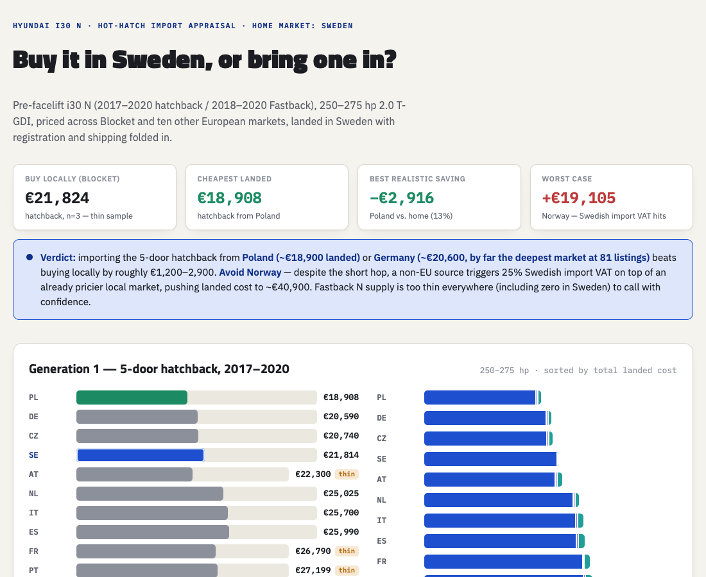
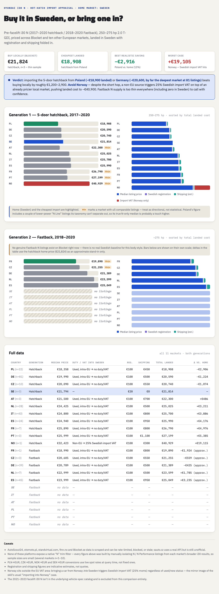
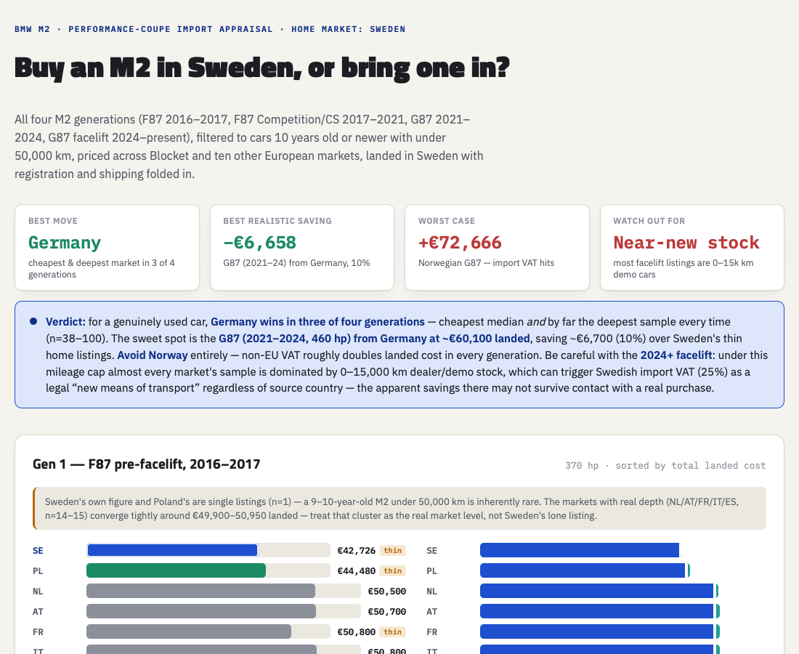
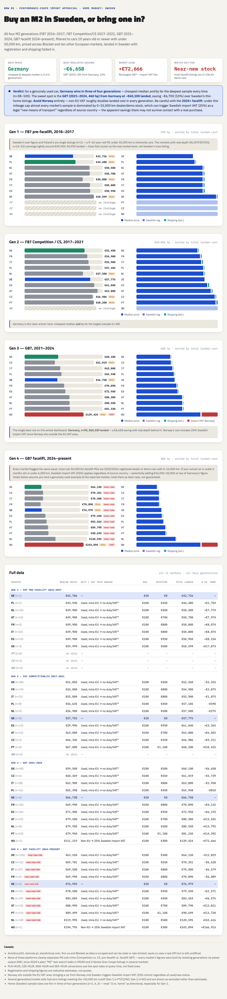

# car_appraisal

Ask Claude Code "is it cheaper to buy this car locally or import it from Germany, Italy, France, Netherlands, Austria, Spain, Poland, Portugal, Czechia, Norway, or Sweden?" — backed by seven MCP servers:

- **cars-data** — global vehicle specs (no pricing).
- **autoscout24-mcp** — real listing prices, one MCP server instance per market (DE/IT/FR/NL/AT/ES), since the underlying tool only supports one market per process.
- **otomoto-pl** — a small custom-built MCP server (`mcp-servers/otomoto-pl/`) for Poland, since AutoScout24 doesn't cover that market. Scrapes otomoto.pl's own embedded JSON the same way `autoscout24-mcp` does for AS24, and converts PLN prices to EUR via a live ECB reference rate for comparison.
- **standvirtual-pt** — another small custom-built MCP server (`mcp-servers/standvirtual-pt/`) for Portugal. standvirtual.com runs the *same* underlying platform as otomoto.pl (both OLX Group), so this is largely the same scraping approach adapted for standvirtual's URL/field conventions. Prices are natively EUR, no conversion needed.
- **sauto-cz** — a third custom-built MCP server (`mcp-servers/sauto-cz/`) for Czechia. Unlike the other two, sauto.cz exposes a genuine JSON REST API (reverse-engineered from the site's own network requests), not scraped embedded JSON — see `mcp-servers/sauto-cz/sauto_client.py` for the endpoint/param details. Converts CZK prices to EUR the same way otomoto-pl does.
- **finn-no** — a fourth custom-built MCP server (`mcp-servers/finn-no/`) for Norway. finn.no embeds its full search results (listings *and* the complete make/series/model taxonomy) as base64-encoded JSON inside a `<script type="application/json">` tag on the plain-HTML search page — no headless browser needed, and no separate API call to find. Converts NOK prices to EUR the same way otomoto-pl does.
- **blocket-se** — a fifth custom-built MCP server (`mcp-servers/blocket-se/`) for Sweden. blocket.se runs the *exact same* Schibsted "mobility" platform as finn.no (same response shape, even the same make/model taxonomy codes), so this is the same embedded-JSON approach adapted for blocket.se's domain/currency. Converts SEK prices to EUR the same way otomoto-pl does.

The actual comparison logic (variant enumeration, EU duty/VAT rules, registration-fee lookup, shipping estimate) lives in `.claude/skills/car-import-appraisal/`.

## Example output

Query: *"I'm in Sweden, is a Hyundai i30 N (2017–2020) cheaper to buy locally or import?"*



The skill returns a verdict up front (import from Poland or Germany, avoid Norway), then a full breakdown per market — median listing price, registration, shipping, and any import VAT — for both the hatchback and Fastback body styles, plus a full data table:



| | |
|---|---|
| **Buy locally (Blocket)** | €21,824 (n=3, thin sample) |
| **Cheapest landed** | €18,908 — hatchback from Poland |
| **Best realistic saving** | −€2,916 vs. home (13%) |
| **Worst case** | +€19,105 — Norway triggers Swedish import VAT |

Query: *"I'm in Sweden, is a BMW M2 (any generation) cheaper to buy locally or import?"*



Here the skill compares across all four M2 generations at once (F87 2016–2017, F87 Competition/CS 2017–2021, G87 2021–2024, G87 facelift 2024–present), flags a mileage-driven import-VAT trap on near-new facelift stock, and rolls everything into one dashboard:



| | |
|---|---|
| **Best move** | Germany — cheapest & deepest market in 3 of 4 generations |
| **Best realistic saving** | −€6,658 — G87 (2021–24) from Germany (10%) |
| **Worst case** | +€72,666 — Norwegian G87 hit by import VAT |
| **Watch out for** | Near-new facelift stock risking a "new means of transport" VAT trap |

## Prerequisites

- Claude Code CLI.
- Go 1.26+ (`brew install go` — already done for this project) — for `autoscout24-mcp`.
- Python 3.11+ — for `otomoto-pl`, `standvirtual-pt`, `sauto-cz`, `finn-no`, and `blocket-se` (each already set up with its own venv in this repo).
- Optional: Python + [Camoufox](https://github.com/daijro/camoufox) (`pip install "camoufox[geoip]"`) — only needed if AutoScout24 starts blocking plain HTTP requests for a given market (403/429). Not required for initial setup.

## Setup

1. Install the AutoScout24 MCP binary:
   ```
   go install github.com/adambenhassen/autoscout24-mcp/cmd/autoscout24-mcp@latest
   ```
2. Confirm its path matches `.mcp.json` (`command` fields point at `/Users/hugo/go/bin/autoscout24-mcp` — this is `$(go env GOPATH)/bin/autoscout24-mcp`, hardcoded as an absolute path because Claude Code spawns stdio MCP servers with a restricted `PATH` that won't reliably resolve a bare command name).
3. The `otomoto-pl`, `standvirtual-pt`, `sauto-cz`, `finn-no`, and `blocket-se` servers each already have their own venv checked into `mcp-servers/<name>/.venv` with dependencies installed (`mcp`, `httpx`) — `.mcp.json` points straight at each venv's Python. If a venv is missing/moved, recreate it:
   ```
   cd mcp-servers/<otomoto-pl|standvirtual-pt|sauto-cz|finn-no|blocket-se>
   python3 -m venv .venv
   ./.venv/bin/pip install -r requirements.txt
   ```
4. `.mcp.json` already registers all 12 servers (1 http + 6 AS24 stdio + otomoto-pl + standvirtual-pt + sauto-cz + finn-no + blocket-se). No API keys needed for any of them.

## Verify

```
claude mcp list
```
Should show `cars-data` (6 tools), `as24-de` / `as24-it` / `as24-fr` / `as24-nl` / `as24-at` / `as24-es` (5 tools each), `otomoto-pl` (3 tools), `standvirtual-pt` (3 tools), `sauto-cz` (3 tools), `finn-no` (3 tools), and `blocket-se` (3 tools), all `Connected`.

Then, in a Claude Code session in this directory, try:
- "search cars-data for bmw 120d" — should return multiple generations/year ranges.
- "list BMW makes/models on as24-it" — confirms that market's server is wired correctly.
- "run price_analysis on otomoto-pl for bmw seria-1" — confirms the Poland server is wired correctly.
- "run price_analysis on standvirtual-pt for bmw 116" — confirms the Portugal server is wired correctly (note: standvirtual needs the trim number "116", not "seria-1"/"1-series", see Known limitations).
- "run list_makes_models on sauto-cz for bmw" — confirms the Czechia server is wired correctly; should return sauto's real BMW model list (Řada 1, Řada 3, X3, etc.).
- "run list_makes_models on finn-no for bmw 120d" — confirms the Norway server is wired correctly; should resolve to finn's real "120d" taxonomy leaf under "1-Serie".
- "run price_analysis on blocket-se for bmw 1-series" — confirms the Sweden server is wired correctly.

## Usage

Ask naturally, e.g.:
> I'm in Italy, I want a BMW 120d, model years 2005–2026 — is it cheaper to buy locally or import it?

This triggers the `car-import-appraisal` skill, which enumerates matching generations, checks prices across all 11 markets, applies EU used-car duty/VAT rules (plus Poland's akcyza, Portugal's ISV, and Norway's non-EU VAT/engangsavgift exceptions), adds an indicative registration-fee and shipping estimate, and returns a comparison table + dashboard artifact with a verdict.

## Troubleshooting

- **403/429 from AutoScout24 for a market**: the scraper's plain-HTTP fetcher got blocked. Set that market's `AS24_FETCHERS` env var in `.mcp.json` to `"http,camoufox"` (requires the Camoufox Python install above) and retry.
- **"command not found" for an `as24-*` server**: `.mcp.json`'s `command` must be an absolute path to the compiled binary, not a bare `autoscout24-mcp` — Claude Code's stdio subprocess PATH is restricted.
- **cars-data unreachable**: it's a plain HTTP MCP server (`https://api.cars-data.com/mcp`), no auth — check general network connectivity if it fails.
- **otomoto-pl / standvirtual-pt / sauto-cz / finn-no / blocket-se errors/blocked**: same class of issue as AS24 — any of these sites may rate-limit or serve a challenge page to plain HTTP requests. None of these servers has a headless-browser escalation path (unlike AS24's Camoufox option); if this starts happening, that's the next thing to add to the relevant client module.
- **otomoto-pl / standvirtual-pt `list_makes_models` returns `valid: false`, or `search_listings`/`price_analysis` raise a "model slug not recognized" error, for a real car**: these sites' URL slugs don't always match a naive lowercase-hyphenate of the display name (both tools error rather than silently returning whole-make data under a wrong model, unlike the plain-HTTP scraping itself succeeding). For standvirtual specifically, makes like BMW are modeled by trim number (`"116"`, `"120"`), not series name — check the actual site URL for that make/model in a browser and pass the exact slug.
- **sauto-cz `list_makes_models` says a make/model wasn't found**: sauto validates against its real filter codebook rather than guessing, so this means the name genuinely doesn't match (e.g. wrong spelling, or the model belongs to a different make) — call `list_makes_models` with just the make to see the full real model list instead of guessing a slug.
- **finn-no / blocket-se `list_makes_models` says a make/model wasn't found**: same as sauto-cz — these validate against the site's real make/series/model taxonomy tree (embedded in every search response), so this means the name genuinely doesn't resolve. Try the make alone first to see the full series list, or pass a specific trim (e.g. "120d") instead of a series name.

## Known limitations

- Pricing coverage: Germany, Italy, France, Netherlands, Austria, Spain (via AutoScout24), Poland (via otomoto.pl), Portugal (via standvirtual.com), Czechia (via sauto.cz), Norway (via finn.no), and Sweden (via blocket.se). No pricing data for any other country (e.g. Denmark) — no free, low-maintenance data source was found for that market yet.
  - **Denmark (Bilbasen)** — returned an empty HTTP 202 to a plain request, consistent with an active bot-challenge (Cloudflare-style); would likely need headless-browser rendering from the start.
- **Norway is not an EU market** (EEA/EFTA only) — the skill's default "used, private, intra-EU sale = no duty/VAT" rule does not apply to Norway at all; see `.claude/skills/car-import-appraisal/references/registration-fees.md` for its VAT/engangsavgift treatment. Sweden, unlike Norway, is a normal EU market for this purpose.
- `autoscout24-mcp`, `otomoto-pl`, `standvirtual-pt`, `finn-no`, and `blocket-se` are all unofficial scrapers (parsing each site's embedded JSON), not official APIs — any of them can break if the site changes its markup, and all are subject to anti-bot/rate-limiting. `sauto-cz` uses a real REST API, which is more robust to markup changes but is still unofficial/undocumented and could change without notice.
- `otomoto-pl`'s PLN→EUR, `sauto-cz`'s CZK→EUR, `finn-no`'s NOK→EUR, and `blocket-se`'s SEK→EUR conversions all use a live spot rate (ECB reference rate via the free Frankfurter API) fetched at query time — a reasonable comparison figure, not the exact rate you'd get at actual payment time.
- Registration-fee figures in `.claude/skills/car-import-appraisal/references/registration-fees.md` are indicative categories, not live/authoritative numbers — verify current rates before acting on them.
- Shipping cost is a rough distance-based estimate, not a real transporter quote.
